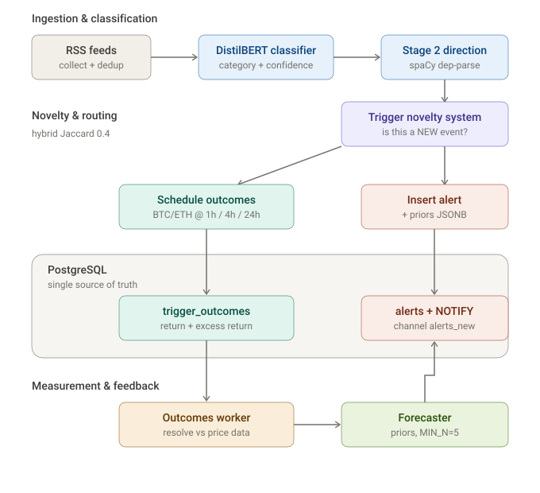

# news-classifier

A real-time pipeline that reads crypto-market news, decides which headlines represent *genuinely new* market-moving events, measures what the market actually did afterwards, and turns that history into calibrated, topic-conditional return priors.

The system is deliberately **deterministic and measurable** end-to-end. Every stage has typed inputs and outputs, is unit-tested, and produces something you can check against ground truth. The central question it exists to answer is falsifiable: *do headline-conditional priors predict forward returns better than chance, once you remove market drift?*

> **TL;DR for the skim-reader.** News → DistilBERT classifier → spaCy directional extraction → novelty/trigger clustering → outcome measurement (BTC/ETH @ 1h/4h/24h) → calibrated priors. ~7k lines of Python, 98 unit tests, 5 Docker services, 9 idempotent migrations. The thing I'm proudest of isn't a model — it's that the system is built to **tell you the truth about whether it works**, including two rigorous tests (detrended calibration and a retrospective COVID validation) that both honestly returned *"not predictive yet."* Sections worth your time: [Engineering decisions](#engineering-decisions-worth-highlighting) and [the COVID validation](#a-rigorous-null-the-covid-validation-exercise). For the deeper "walk me through how it works" version, see [docs/ARCHITECTURE.md](docs/ARCHITECTURE.md).

---

## Why it exists

Markets react to the **first** appearance of a narrative, not the 500th article about it. An early prototype classified news well but fired a "market-moving" alert on **37.6% of all headlines** during a single geopolitical escalation — it had no concept that 500 articles about one event aren't 500 events. The bulk of this project is the machinery that fixes that: novelty detection, directional disambiguation, and an honest measurement loop that tells you whether any of it is actually predictive.

It is built as a **producer**: it emits alerts (with priors attached) onto a Postgres table that a separate consumer system reads via `LISTEN/NOTIFY`. The producer never makes trading decisions — it generates measurable signals and leaves position-sizing and risk to the consumer.

---

## Pipeline at a glance



The flow runs top-to-bottom: ingestion and classification, then novelty routing, across the Postgres boundary, into measurement — with a feedback arrow from the forecaster back to alert insertion (the loop that lets priors improve as outcomes accumulate). A text version of the same flow:

```
RSS feeds ─► dedup ─► DistilBERT classifier ─► Stage 2 directional extraction
                                                      │
                                                      ▼
                                         novelty / trigger clustering
                                          (is this a NEW event?)
                                                      │
                          ┌───────────────────────────┼───────────────────────────┐
                          ▼                           ▼                           ▼
                    novel event?                schedule outcomes          insert alert
                  (tighten gates)            (BTC/ETH @ 1h/4h/24h)        (+ priors JSONB)
                                                      │                           │
                                                      ▼                           ▼
                                       outcomes worker resolves            Postgres alerts
                                       returns from price_snapshots         table + NOTIFY
                                                      │                           │
                                                      ▼                           ▼
                                          forecaster aggregates          downstream consumer
                                          priors per (topic,             (separate system)
                                          direction, asset, horizon)
```

### 1. Collection & classification
RSS collection across multiple feeds with title-hash dedup. A fine-tuned **DistilBERT** classifier assigns each headline a category (geopolitical, regulatory, macro, …) and a confidence. Only certain categories are eligible to track events.

### 2. Stage 2 — directional verb extraction
The original failure was *directional ambiguity*: "Iran threatens to **close** Hormuz" and "Iran offers to **reopen** Hormuz" matched the same trigger and cancelled each other's signal. Stage 2 uses **spaCy dependency parsing** plus a hand-built [verb taxonomy](config/verb_taxonomy.py) (12 categories, ~114 lemmas) to extract a direction — `escalation` / `de-escalation` / `neutral` / `context-dependent` — including a complement-verb resolver for the "X threatens to close Y" construction and explicit negation handling. Two triggers with the same entities but opposite strong directions are kept separate.

### 3. Novelty / trigger system
Headlines are clustered into **triggers** (narrative threads) using hybrid Jaccard similarity — 70% named-entity overlap + 30% keyword overlap, with alias canonicalisation (`federal reserve → fed`, `strait of hormuz → hormuz`). A trigger has a lifecycle (`ACTIVE → FADING → STALE → ARCHIVED`) with impact decay: only the **first** appearance of a narrative tightens gates; follow-ups are suppressed. This is what took alert rate from 37.6% of headlines down to a defensible fraction.

### 4. Outcome tracking
When a novel trigger fires, the system schedules **outcome rows** for BTC and ETH at 1h / 4h / 24h horizons. A worker resolves them against hourly OHLCV in `price_snapshots`, computing the realised return — and, after detrending was added, the **excess return** over the asset's prior-window drift.

### 5. Forecaster & calibration
The [forecaster](pipeline/forecaster.py) aggregates resolved outcomes into priors keyed by `(signature_root, direction, asset, horizon)`, dropping any cell with fewer than `MIN_N=5` samples. Priors are computed **as-of-fire-time** (only using outcomes whose trigger fired strictly before the alert), so backtests don't leak future data. A [calibration harness](scripts/calibrate_forecaster.py) does a chronological train/test split and reports per-cell sign-agreement, MAE, and prior-vs-actual means.

---

## Engineering decisions worth highlighting

These are the parts I'd want to talk through in an interview — each was a deliberate trade-off, not a default.

**Honest measurement over impressive numbers.** The forecaster supports both raw and *detrended* returns. On the first real dataset, raw priors showed 59.5% sign-agreement — but detrending (subtracting the market's prior-window drift) dropped that to **49.4%**, i.e. coin-flip. That drop is the headline result: most of the apparent signal was a bull-market regime confound, not topic-conditional knowledge. The system is built to surface that disappointment rather than hide it, because a prior that only works in one regime is worse than no prior.

**As-of-fire-time priors.** `priors_for_trigger(before=fire_time)` filters outcomes to those known before the alert. Without this, a backtest silently leaks the future into the past and every prior looks predictive. This is one line of API design that determines whether the whole evaluation is trustworthy.

**Historical replay with time-mocking.** Rather than wait months for forward data, the system can replay ~years of historical headlines through the *exact same* `process_headline` code path, with `now=published_at` injected so the trigger state machine computes decay against the historical clock. Replay runs against an isolated `replay` Postgres schema (via `search_path`) so it never touches live data, and is resumable from a checkpoint table. Production code stays unchanged — the time-mock is an optional parameter that's a no-op for live callers.

**Idempotent, additive migrations.** Plain SQL migrations (`CREATE … IF NOT EXISTS`, `ADD COLUMN IF NOT EXISTS`) run on every container start via the entrypoint. Re-running is a sub-second no-op; new deploys self-migrate; nothing is destructive. Detrending was added as new columns alongside the originals, with a backfill script, so historical data stayed comparable.

**Connection-per-cycle for long-running workers.** A subtle production bug: a worker held one DB connection across a 9-hour loop, it silently degraded, and `SELECT`s started returning empty without raising — the worker logged `scanned=0` while real work sat undone. Fix was to open a fresh connection each cycle (negligible cost at this poll rate, immune to the whole bug class). A second bug in the same area — counters incrementing in Python *before* a commit that never happened — is the reason the worker now commits explicitly and the stats reflect persisted reality.

---

## A rigorous null: the COVID validation exercise

`research/covid_exercise/` is a self-contained retrospective test of a related idea — *can monitoring the frequency of "shouldn't-matter-yet" outbreak language detect a crowd warm-up before markets price it in?* It's worth reading because of **how** it's built, not because it succeeded:

- **A gold-standard event with controls.** COVID (markets crashed −34%) as the positive case; Ebola/MERS (didn't crash) as negative controls that *should stay quiet*.
- **No-lookahead discipline, enforced.** Keywords are pre-COVID-defensible only (`outbreak`, `pandemic`, `mystery illness` — never `coronavirus`/`SARS-CoV-2`). Baselines are recomputed each day using only prior data. The success criterion was fixed in advance: alerts must fire *before* the Feb 19 2020 top with usable lead time.
- **FinBERT-tone overlay** to test whether coverage *sentiment* deteriorated even when raw frequency didn't.

**The result was a clean null.** The naive frequency-anomaly detector fired **0 alerts across 152 COVID days** — it completely missed the warm-up. The full results sit in [`research/covid_exercise/outputs/covid_analysis.md`](research/covid_exercise/outputs/covid_analysis.md), unedited.

That's deliberately kept in the repo. The exercise did its job: it falsified the simple hypothesis and pointed precisely at what a real system would need — source-diversification weighting, semantic content analysis rather than keyword counts, and non-English early sources (the COVID warm-up was visible in Chinese-language outlets weeks before Western ones). A test that can only confirm isn't a test; this one could fail, and did, and that's the point.

---

## Tech stack

- **Python 3.12**, PostgreSQL
- **PyTorch / Transformers** (DistilBERT) for classification
- **spaCy** (`en_core_web_sm`) for dependency-parse directional extraction
- **Docker Compose** — five services (live pipeline, outcomes worker, price backfill, calibration history, snapshot capture)
- CPU-only Torch in the runtime image (≈750 MB vs ≈2.5 GB with CUDA libs that were never used)
- **98 unit tests** (pure-function logic mocked away from the DB)

---

## Repository layout

```
collectors/     RSS + historical backfill (CoinDesk, GDELT, Wayback, Binance prices)
inference/      DistilBERT classifier + spaCy directional verb extractor
config/          verb taxonomy + 9 idempotent SQL migrations
pipeline/        triggers, outcomes, forecaster, alerter, live loop
scripts/         replay, calibration, outcome worker, backfills, monitors
tests/           unit tests for triggers, outcomes, forecaster, extractor, alerter
capture/         market-state snapshot pipeline (spot/orderbook/derivs/options)
training/        classifier training
```

---

## Running it

```bash
# 1. Configure DB credentials
cp .env.docker.example .env.docker   # edit DB_PASSWORD; DB_HOST=host.docker.internal

# 2. Build and start (migrations run automatically on startup)
docker compose build
docker compose up -d

# 3. Tail the live pipeline
docker compose logs -f news-classifier
```

Tests:

```bash
pip install -r requirements.txt -r requirements-train.txt
python -m pytest tests/
```

Calibration (the "does any of this work?" check):

```bash
python -m scripts.calibrate_forecaster --aggregate-by category --metric excess_return_pct
```

---

## Status & honest limitations

This is a **research / signals system**, not financial advice and not a trading bot. Current state:

**What works and is genuinely solid:**
- The full pipeline runs autonomously and reliably — collection, classification, directional extraction, novelty clustering, outcome resolution, forecasting, and daily calibration, all under Docker with self-applying migrations.
- The novelty/trigger system **demonstrably solved the original problem**: alert rate dropped from 37.6% of all headlines to a defensible fraction by correctly recognising that repeated coverage of one event isn't multiple events.
- The directional extraction correctly disambiguates the cases that originally broke the system (the "Iran threatens to close Hormuz" vs "offers to reopen" class of ambiguity).
- The evaluation harness is trustworthy: as-of-fire-time priors, chronological splits, detrending, and controls mean the numbers it reports can be believed — including when they're disappointing.

**What isn't proven yet (and the system says so):**
- On the data collected so far, **detrended priors are not yet predictive** — near-coin-flip once market drift is removed. Expected on a short window dominated by a single narrative regime; the honest answer is "not enough varied data yet," not "it works."
- The COVID frequency-detector returned a clean null. That experiment's value is in its rigour and what it rules out, not in a positive hit.
- A daily calibration-history job records per-cell metrics over time, so the signal/noise question gets answered as more varied data accumulates rather than from a single hopeful snapshot.

The thing I'm most satisfied with is not any single model — it's that the system is built to **tell you the truth about whether it works.** It already proves it can solve a concrete, hard problem (novelty detection), and it's honest enough to say "the predictive layer isn't there yet" instead of cherry-picking a number that looks good in one regime. That combination — it works where it can be shown to work, and it's candid where it can't — is the engineering culture I wanted the project to demonstrate.
